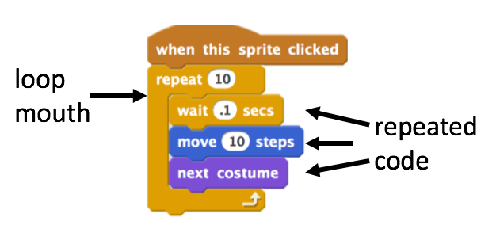
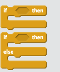

# Loops and Conditionals

In this section we will get to grips with a key control feature of programming - looping. Looping at its simplest is just doing things over and over again until you have some reason to stop. Loops are a way of making the computer really work for you.

A loop is a code construct that contains code. Think of it as a box of code that gets run over and over. In Scratch the graphical metaphor is very simple, you have a block with a mouth, inside that mouth is the loop code, everything in the mouth gets repeated. 

```{r, echo = FALSE, fig.width = 6}
  
```


These things make a lot more sense when you see them in use. Let's examine some loops by building some that make music!

```{block2, type = "task"}
  
  1. Do the [build a band worksheet](worksheets/scratch_build_a_band.pdf)
  2. Experiment with timing and the number of repeats in each repeat section to come up with a pleasing musical arrangement.

```


So that's the basic idea, loops do stuff over and over. They can do set numbers of repeats, keep going forever or keep going until something else happens.

Let's have a look at some code with loops, some of which needs fixing. 

```{block2, type = "task"}

  1. Do the [loop debugging worksheet](worksheets/scratch_loop_debugging.pdf)
  2. In your critique groups or your design journal:
      * Discuss the importance of the counter in the loop? When can it break the code?

```

## Types of loop blocks

Mostly here we've seen the `repeat` loop block, thats the most obvious sort but there are plenty of variations. 

  * `until` loop blocks do some code _until_ something happens, that something can be specified by a  e.g a sprite hits the side, or a number gets too big.
  * `while` loop blocks do some code _while_ some thing is still in some state, 
  * `forever` loop blocks do some code forever - this is more common than you think, especially in games for example. With these the main block of code just goes forever and stops only when something exceptional happens, like lives reaching `0`.

```{block2, type = "task"}
  1. In your critique group or design journal discuss whether all these types of loop are actually interchangeable? 
  2. Is there some sort of redundancy in all of these types of loop? 
  3. What might be the reason for this?

```

## Conditionals

Along the way we've already seen a different type of control block - a conditional. This is a block that contains code that will only be done if something specified by the programmer is true. You'll notice this block because it begins with `if` and then there's some thing that must be tested to see if its true, this is the actual condition to be tested.

You can see the place for the condition in this picture as a gap after the word `if`, that gap is waiting for the programmer to drop in any sort of thing to test.

```{r, echo = FALSE, fig.width = 6}

```

A conditional (or simply just an `if` block) is the easiest way to get a computer program make a decision and only do something in certain cases. They are abundant throughout computer programming.

In the upper form the code in the 'mouth' will only be run if the conditional test passes. If it doesn't pass the test none of that code will be run. The rest of the program will carry on as if that code wasn't even there.

The `if-else` form provides a way to be explicit about what to do if the condition doesn't pass. If the condition for `if` doesn't pass, then the code in the `else` block runs. Note that the two blocks are mutually exclusive, if one block runs, the other won't. 


## A creative project

It's time to put some of our skills and creativity to use and build something brand new. For this next section we will build something personalised and/or exciting. Choose one of the activities below and enjoy building something you like!

```{block2, type = "task"}

  1. Make an interactive collage about yourself [^3],  using the [About Me worksheet](worksheets/scratch_about_me.pdf) for a bit of guidance.

or

  2. Make a music video. Use the [Music Video worksheet](worksheets/scratch_music_video.pdf) 

```

## In this section we...

```{block2, type = "roundup"}
We have encountered blocks and conditionals and use them to make stuff happen over and over, and only when we want it to. They save us from having to write out repetitive code.

These two types of blocks are at the heart of controlling the sequence of execution of code in a program. Practice with loops and conditionals will make you a powerful master of the things a computer does.
```


[^3]: Or an alter-ego you've constructed for the purposes of this exercise!